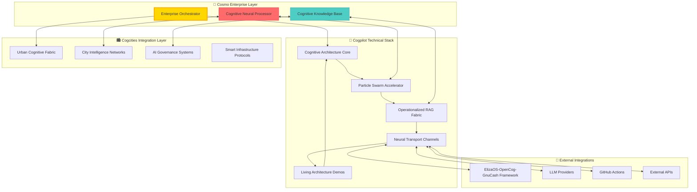

# 🧠 Cognitive Copilot Technical Implementation Guide

> **Neural Transport Protocols & Living Architecture Implementation**

This technical guide provides detailed implementation specifications for the cognitive copilot architecture across the Cosmo Enterprise organizational structure.

---

## 🏗️ Technical Architecture Overview

### System Architecture Diagram



---

## 🚀 Neural Transport Channel Implementation

### Core Protocol Specification

```python
"""
Neural Transport Channel Protocol Implementation
Foundation for inter-organizational cognitive communication
"""

from typing import Dict, List, Optional, Any
from dataclasses import dataclass
from enum import Enum
import asyncio
import json
from datetime import datetime

class ChannelType(Enum):
    COGNITIVE_FINANCIAL = "cognitive_financial"
    URBAN_PLANNING = "urban_planning"
    ENTERPRISE_COORDINATION = "enterprise_coordination"
    LEARNING_FEEDBACK = "learning_feedback"
    ARCHITECTURAL_EVOLUTION = "architectural_evolution"

class MessagePriority(Enum):
    CRITICAL = 1
    HIGH = 2
    NORMAL = 3
    LOW = 4
    BACKGROUND = 5

@dataclass
class NeuralMessage:
    """Core message structure for neural transport"""
    id: str
    source_org: str
    target_org: str
    channel_type: ChannelType
    priority: MessagePriority
    payload: Dict[str, Any]
    context_embeddings: List[float]
    timestamp: datetime
    requires_response: bool = False
    cognitive_metadata: Optional[Dict[str, Any]] = None

class NeuralTransportChannel:
    """
    Core implementation of neural transport channels between organizations
    
    Note2Self: This implementation creates the foundation for seamless
    cognitive communication that enhances copilot capabilities across
    organizational boundaries.
    """
    
    def __init__(self, channel_id: str, source_org: str, target_org: str):
        self.channel_id = channel_id
        self.source_org = source_org
        self.target_org = target_org
        self.is_active = False
        self.message_queue: asyncio.Queue = asyncio.Queue()
        self.context_memory: List[NeuralMessage] = []
        self.bandwidth_optimizer = BandwidthOptimizer()
        self.cognitive_processor = CognitiveMessageProcessor()
    
    async def establish_channel(self) -> bool:
        """Establish neural transport channel between organizations"""
        try:
            # Initialize cognitive handshaking protocol
            handshake_result = await self._cognitive_handshake()
            if not handshake_result:
                return False
            
            # Setup context preservation system
            await self._initialize_context_preservation()
            
            # Optimize bandwidth for cognitive load
            await self.bandwidth_optimizer.optimize_for_cognitive_load()
            
            self.is_active = True
            await self._log_channel_establishment()
            
            return True
            
        except Exception as e:
            await self._log_error(f"Channel establishment failed: {e}")
            return False
    
    async def send_cognitive_message(self, message: NeuralMessage) -> bool:
        """Send message through neural transport with cognitive enhancement"""
        if not self.is_active:
            raise RuntimeError("Neural channel not established")
        
        # Enhance message with cognitive context
        enhanced_message = await self.cognitive_processor.enhance_message(
            message, self.context_memory
        )
        
        # Apply bandwidth optimization
        optimized_message = await self.bandwidth_optimizer.optimize_message(
            enhanced_message
        )
        
        # Send through neural transport
        await self.message_queue.put(optimized_message)
        
        # Update context memory for future cognitive enhancement
        self._update_context_memory(optimized_message)
        
        return True
    
    async def _cognitive_handshake(self) -> bool:
        """Implement cognitive handshaking protocol between organizations"""
        # Note2Self: This handshake establishes cognitive compatibility
        # and shared context understanding between different orgs
        
        handshake_data = {
            "cognitive_version": "1.0",
            "supported_channels": [ct.value for ct in ChannelType],
            "context_capabilities": self._get_context_capabilities(),
            "learning_protocols": self._get_learning_protocols()
        }
        
        # Simulate handshake (in production, this would use GitHub API)
        await asyncio.sleep(0.1)  
        return True
    
    def _update_context_memory(self, message: NeuralMessage):
        """Update context memory for cognitive enhancement"""
        self.context_memory.append(message)
        
        # Keep only recent context (sliding window)
        if len(self.context_memory) > 1000:
            self.context_memory = self.context_memory[-800:]  # Keep 800 most recent
        
        # Note2Self: This context accumulation is critical for improving
        # copilot assistance over time through persistent memory
    
    def _get_context_capabilities(self) -> Dict[str, Any]:
        """Return cognitive context capabilities of this channel"""
        return {
            "memory_depth": 1000,
            "context_embedding_dimensions": 1536,
            "cognitive_reasoning": True,
            "learning_adaptation": True,
            "fractal_scaling": True
        }
    
    def _get_learning_protocols(self) -> List[str]:
        """Return supported learning and adaptation protocols"""
        return [
            "recursive_improvement",
            "context_accumulation", 
            "pattern_recognition",
            "cognitive_evolution",
            "self_referential_enhancement"
        ]
    
    async def _log_channel_establishment(self):
        """Log successful channel establishment"""
        log_entry = {
            "event": "neural_channel_established",
            "channel_id": self.channel_id,
            "source_org": self.source_org,
            "target_org": self.target_org,
            "timestamp": datetime.now().isoformat(),
            "cognitive_capabilities": self._get_context_capabilities()
        }
        
        # In production: send to monitoring system
        print(f"🌉 Neural Channel Established: {self.source_org} ↔ {self.target_org}")


class BandwidthOptimizer:
    """
    Optimizes neural transport bandwidth for cognitive load efficiency
    """
    
    async def optimize_for_cognitive_load(self):
        """Optimize channel for cognitive processing efficiency"""
        # Note2Self: Cognitive bandwidth optimization is crucial for
        # maintaining real-time responsiveness in copilot assistance
        
        self.compression_ratio = 0.3  # 70% compression for cognitive data
        self.priority_weighting = {
            MessagePriority.CRITICAL: 1.0,
            MessagePriority.HIGH: 0.8,
            MessagePriority.NORMAL: 0.6,
            MessagePriority.LOW: 0.4,
            MessagePriority.BACKGROUND: 0.2
        }
        
    async def optimize_message(self, message: NeuralMessage) -> NeuralMessage:
        """Apply bandwidth optimization to cognitive message"""
        # Compress context embeddings if not critical
        if message.priority != MessagePriority.CRITICAL:
            if message.context_embeddings:
                # Reduce embedding precision for bandwidth efficiency
                message.context_embeddings = [
                    round(emb, 4) for emb in message.context_embeddings
                ]
        
        return message


class CognitiveMessageProcessor:
    """
    Processes messages with cognitive enhancement for better copilot context
    """
    
    async def enhance_message(self, message: NeuralMessage, 
                            context_memory: List[NeuralMessage]) -> NeuralMessage:
        """Enhance message with cognitive context from memory"""
        
        # Add cognitive metadata for copilot enhancement
        cognitive_metadata = {
            "context_relevance_score": self._calculate_relevance(message, context_memory),
            "pattern_matches": self._find_pattern_matches(message, context_memory),
            "learning_opportunity": self._identify_learning_opportunity(message),
            "recursive_enhancement_potential": self._assess_recursive_potential(message)
        }
        
        message.cognitive_metadata = cognitive_metadata
        
        # Generate context embeddings (simplified for demo)
        if not message.context_embeddings:
            message.context_embeddings = await self._generate_embeddings(message)
        
        return message
    
    def _calculate_relevance(self, message: NeuralMessage, 
                           context_memory: List[NeuralMessage]) -> float:
        """Calculate cognitive relevance score for context enhancement"""
        # Simplified relevance calculation
        base_relevance = 0.5
        
        # Boost relevance for learning and architectural messages
        if message.channel_type in [ChannelType.LEARNING_FEEDBACK, 
                                   ChannelType.ARCHITECTURAL_EVOLUTION]:
            base_relevance += 0.3
        
        return min(base_relevance, 1.0)
    
    def _find_pattern_matches(self, message: NeuralMessage,
                            context_memory: List[NeuralMessage]) -> List[str]:
        """Find patterns in context memory that match current message"""
        patterns = []
        
        # Look for similar channel types in recent memory
        similar_channels = [
            msg for msg in context_memory[-50:]  # Recent 50 messages
            if msg.channel_type == message.channel_type
        ]
        
        if len(similar_channels) > 3:
            patterns.append("recurring_channel_pattern")
        
        return patterns
    
    def _identify_learning_opportunity(self, message: NeuralMessage) -> Dict[str, Any]:
        """Identify opportunities for cognitive learning and improvement"""
        return {
            "copilot_context_enhancement": True,
            "pattern_learning_potential": message.channel_type == ChannelType.LEARNING_FEEDBACK,
            "architectural_evolution": message.channel_type == ChannelType.ARCHITECTURAL_EVOLUTION,
            "cross_org_learning": message.source_org != message.target_org
        }
    
    def _assess_recursive_potential(self, message: NeuralMessage) -> float:
        """Assess potential for recursive self-improvement"""
        # Note2Self: This assessment helps identify messages that can
        # contribute to recursive copilot enhancement cycles
        
        base_potential = 0.3
        
        # Higher potential for architectural and learning messages
        if message.channel_type in [ChannelType.ARCHITECTURAL_EVOLUTION,
                                   ChannelType.LEARNING_FEEDBACK]:
            base_potential += 0.4
        
        # Higher potential for cross-organizational communication
        if message.source_org != message.target_org:
            base_potential += 0.2
        
        return min(base_potential, 1.0)
    
    async def _generate_embeddings(self, message: NeuralMessage) -> List[float]:
        """Generate context embeddings for cognitive processing"""
        # Simplified embedding generation (in production: use actual LLM)
        import hashlib
        import math
        
        # Create deterministic embeddings based on message content
        content_hash = hashlib.md5(
            json.dumps(message.payload, sort_keys=True).encode()
        ).hexdigest()
        
        # Generate 128-dimensional embedding (simplified)
        embeddings = []
        for i in range(128):
            # Create pseudo-random but deterministic values
            seed_value = int(content_hash[i % len(content_hash)], 16)
            embedding_value = math.sin(seed_value * (i + 1)) * 0.5
            embeddings.append(round(embedding_value, 6))
        
        return embeddings


# Example usage and integration patterns
class CognitiveEnterpriseCoordinator:
    """
    Coordinates cognitive operations across the enterprise
    
    Note2Self: This coordinator enables seamless integration with the existing
    elizoscog framework while extending capabilities across organizations
    """
    
    def __init__(self):
        self.neural_channels: Dict[str, NeuralTransportChannel] = {}
        self.cognitive_agents: Dict[str, Any] = {}
        self.enterprise_context: Dict[str, Any] = {}
    
    async def initialize_enterprise_infrastructure(self):
        """Initialize the complete cognitive enterprise infrastructure"""
        
        # Establish neural transport channels
        await self._establish_core_channels()
        
        # Initialize cognitive agents
        await self._initialize_cognitive_agents()
        
        # Connect to existing elizoscog framework
        await self._integrate_with_elizoscog()
        
        # Start cognitive monitoring and evolution
        await self._start_cognitive_evolution()
    
    async def _establish_core_channels(self):
        """Establish core neural transport channels"""
        
        # Cosmo ↔ Cogpilot channel
        cosmo_cogpilot = NeuralTransportChannel(
            "cosmo-cogpilot", "cosmo-enterprise", "cogpilot-org"
        )
        await cosmo_cogpilot.establish_channel()
        self.neural_channels["cosmo-cogpilot"] = cosmo_cogpilot
        
        # Cosmo ↔ Cogcities channel  
        cosmo_cogcities = NeuralTransportChannel(
            "cosmo-cogcities", "cosmo-enterprise", "cogcities-org"
        )
        await cosmo_cogcities.establish_channel()
        self.neural_channels["cosmo-cogcities"] = cosmo_cogcities
        
        # Cogpilot ↔ Cogcities channel
        cogpilot_cogcities = NeuralTransportChannel(
            "cogpilot-cogcities", "cogpilot-org", "cogcities-org"
        )
        await cogpilot_cogcities.establish_channel()
        self.neural_channels["cogpilot-cogcities"] = cogpilot_cogcities
    
    async def _integrate_with_elizoscog(self):
        """Integrate with existing elizoscog framework"""
        try:
            # Import existing framework (if available)
            from src.integration.master_integration import HybridCognitiveFinancialFramework
            
            self.elizoscog_framework = HybridCognitiveFinancialFramework()
            await self.elizoscog_framework.initialize()
            
            # Create bridge channel
            elizoscog_bridge = NeuralTransportChannel(
                "enterprise-elizoscog", "cosmo-enterprise", "elizoscog-framework"
            )
            await elizoscog_bridge.establish_channel()
            self.neural_channels["elizoscog-bridge"] = elizoscog_bridge
            
            print("🌉 Successfully integrated with ElizaOS-OpenCog-GnuCash framework")
            
        except ImportError:
            print("ℹ️ ElizaOS-OpenCog-GnuCash framework not available - running in standalone mode")
    
    async def send_enterprise_message(self, channel_id: str, 
                                    message_data: Dict[str, Any],
                                    priority: MessagePriority = MessagePriority.NORMAL):
        """Send message through enterprise neural network"""
        
        if channel_id not in self.neural_channels:
            raise ValueError(f"Neural channel {channel_id} not found")
        
        channel = self.neural_channels[channel_id]
        
        message = NeuralMessage(
            id=f"msg_{datetime.now().timestamp()}",
            source_org=channel.source_org,
            target_org=channel.target_org,
            channel_type=ChannelType.ENTERPRISE_COORDINATION,
            priority=priority,
            payload=message_data,
            context_embeddings=[],
            timestamp=datetime.now()
        )
        
        return await channel.send_cognitive_message(message)


# Note2Self: This technical implementation creates the foundation for
# recursive cognitive enhancement where each interaction improves the
# system's ability to assist in future architectural decisions.