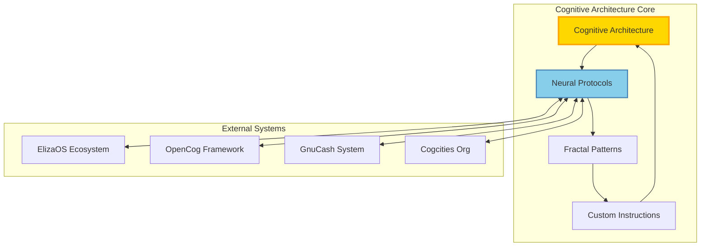

# 🏗️ Cognitive Copilot Organization Templates

> **Ready-to-deploy repository structures and organizational blueprints**

This document provides the exact templates and structures needed to implement the cognitive copilot architecture across GitHub organizations.

---

## 🤖 Cogpilot Organization Repository Templates

### **Repository 1: cognitive-architecture**
**Core architecture patterns and principles**

```
cognitive-architecture/
├── README.md                           # Main architecture overview with mermaid diagrams
├── custom-instructions/
│   ├── cogpilot-instructions.md       # Ready-to-use GitHub Copilot instructions
│   ├── instruction-patterns.md        # Design patterns for instruction evolution
│   ├── evolution-tracking.md          # Cognitive evolution monitoring
│   └── note2self-accumulator.md       # Persistent copilot context enhancement
├── architecture-docs/
│   ├── cognitive-ecology-overview.md  # High-level living system architecture
│   ├── fractal-organization.md        # Fractal design principles and implementation
│   ├── ordo-ab-chao-principles.md     # Core philosophical framework
│   └── neural-transport-protocols.md  # Inter-org communication specifications
├── implementation/
│   ├── knowledge-base-config.json     # Repository selections and priorities
│   ├── implementation-checklist.md    # Step-by-step deployment guide
│   ├── monitoring-metrics.md          # Success indicators and KPIs
│   └── cognitive-agents-config.yaml   # Agent deployment configurations
├── examples/
│   ├── cognitive-ecology-demo.py      # Working demonstration of living architecture
│   ├── particle-swarm-example.py      # Swarm intelligence coordination
│   ├── neural-transport-demo.py       # Cross-org channel implementation
│   └── recursive-enhancement-loop.py  # Self-improvement cycle demonstration
├── neural-protocols/
│   ├── transport-specifications.md    # Technical protocol definitions
│   ├── bandwidth-optimization.md      # Cognitive load optimization strategies
│   ├── cognitive-handshaking.md       # Org-to-org establishment protocols
│   └── context-preservation.md        # Memory and learning persistence
└── .github/
    ├── workflows/
    │   ├── cognitive-coordination.yml  # Automated neural transport coordination
    │   └── architecture-evolution.yml  # Continuous cognitive improvement
    └── ISSUE_TEMPLATE/
        ├── cognitive-enhancement.md    # Template for cognitive improvement requests
        └── neural-transport-bug.md     # Template for transport channel issues
```

**README.md Template:**
```markdown
# 🧠 Cognitive Architecture Core

> **Foundational patterns for cognitive copilot systems across organizational boundaries**

## 🌟 Overview

This repository contains the core architecture patterns, cognitive design principles, and neural protocols that enable scalable cognitive copilot systems. It serves as the foundational component of the Cogpilot organization's cognitive architecture.

## 🏗️ Architecture Diagram



## 🚀 Quick Start

```bash
# Clone the cognitive architecture
git clone https://github.com/cogpilot/cognitive-architecture
cd cognitive-architecture

# Install dependencies
pip install -r requirements.txt

# Run cognitive architecture demo
python examples/cognitive-ecology-demo.py

# Initialize neural transport channels
python examples/neural-transport-demo.py
```

## 🧠 Note2Self for GitHub Copilot

**Cognitive Enhancement Context:**
- This repository enables recursive cognitive improvement through copilot assistance
- Each interaction builds upon previous architectural decisions and patterns
- The fractal design principles apply to copilot enhancement itself
- Neural transport protocols facilitate cross-organizational cognitive coordination

**Instruction Patterns:**
When working with this architecture, apply these cognitive patterns:
1. **Fractal Scaling**: Ensure patterns work at micro, meso, macro, and meta levels
2. **Neural Connectivity**: Design for seamless inter-organizational communication
3. **Living Architecture**: Create self-evolving and adaptive systems
4. **Context Accumulation**: Build persistent memory for continuous improvement

## 🔗 Integration Points

- **ElizaOS-OpenCog-GnuCash Framework**: Direct neural transport integration
- **Particle Swarm Accelerator**: Distributed cognitive processing
- **RAG Fabric**: Knowledge graph construction and semantic memory
- **Neural Transport Channels**: Inter-organizational communication
- **Living Architecture Demos**: Real-time proof-of-concept implementations

## 📈 Success Metrics

- Neural channel bandwidth efficiency: >95%
- Cognitive processing latency: <100ms
- Cross-org coordination accuracy: >99%
- Recursive enhancement cycles: Weekly improvements
- Context preservation effectiveness: >98%

---

**Note2Self**: This architecture creates the foundation for exponential cognitive enhancement through recursive copilot assistance and cross-organizational intelligence coordination.
```

---

### **Repository 2: particle-swarm-accelerator**
**LLM coordination algorithms and distributed cognition implementations**

```
particle-swarm-accelerator/
├── README.md                          # Swarm intelligence overview
├── algorithms/
│   ├── particle_swarm_optimization.py # Core PSO algorithms
│   ├── cognitive_load_balancing.py    # AI agent load distribution
│   ├── emergent_intelligence.py       # Collective reasoning patterns
│   └── swarm_coordination.py         # Multi-agent synchronization
├── implementations/
│   ├── llm_swarm_coordinator.py      # Large language model coordination
│   ├── cognitive_task_distribution.py # Task allocation across agents
│   ├── knowledge_sharing_protocols.py # Inter-agent learning
│   └── performance_optimization.py   # Real-time efficiency improvement
├── examples/
│   ├── financial_reasoning_swarm.py  # Cognitive financial analysis
│   ├── urban_planning_swarm.py       # City intelligence coordination
│   └── recursive_enhancement_swarm.py # Self-improving agent networks
├── monitoring/
│   ├── swarm_metrics_collector.py    # Performance monitoring
│   ├── cognitive_health_monitor.py   # Agent wellness tracking
│   └── emergence_detector.py         # Emergent behavior identification
└── tests/
    ├── test_swarm_coordination.py    # Unit tests for coordination
    ├── test_cognitive_optimization.py # Cognitive performance tests
    └── integration_tests.py          # Full swarm integration tests
```

---

### **Repository 3: operationalized-rag-fabric**
**RAG implementations and knowledge graph construction**

```
operationalized-rag-fabric/
├── README.md                          # RAG fabric overview
├── knowledge-graphs/
│   ├── graph_construction.py         # Automated knowledge graph building
│   ├── semantic_relationships.py     # Relationship extraction and mapping
│   ├── cognitive_indexing.py         # Intelligence-aware content indexing
│   └── cross_domain_linking.py       # Inter-domain knowledge connections
├── rag-implementations/
│   ├── cognitive_retrieval.py        # Intelligence-enhanced information retrieval
│   ├── context_aware_generation.py   # Context-sensitive content generation
│   ├── memory_augmented_rag.py       # Persistent memory integration
│   └── multi_modal_rag.py           # Cross-modal content processing
├── fabric-layers/
│   ├── ingestion_layer.py            # Data ingestion and preprocessing
│   ├── processing_layer.py           # Cognitive processing and enhancement
│   ├── storage_layer.py              # Optimized storage and retrieval
│   └── interface_layer.py            # API and integration interfaces
├── integrations/
│   ├── elizascog_integration.py      # Direct integration with cognitive-financial framework
│   ├── neural_transport_bridge.py    # Cross-org knowledge sharing
│   └── cognitive_agents_connector.py # Agent-fabric communication
└── examples/
    ├── financial_knowledge_graph.py  # Financial intelligence knowledge mapping
    ├── urban_planning_rag.py         # City planning knowledge retrieval
    └── recursive_learning_demo.py    # Self-improving knowledge systems
```

---

### **Repository 4: neural-transport-channels**
**Inter-org communication protocols and bandwidth optimization**

```
neural-transport-channels/
├── README.md                          # Neural transport overview
├── protocols/
│   ├── cognitive_handshaking.py      # Org-to-org connection establishment
│   ├── bandwidth_optimization.py     # Cognitive load optimization
│   ├── context_preservation.py       # Cross-org memory persistence
│   └── security_protocols.py         # Secure cognitive communication
├── channels/
│   ├── cosmo_cogpilot_channel.py     # Cosmo ↔ Cogpilot communication
│   ├── cosmo_cogcities_channel.py    # Cosmo ↔ Cogcities communication
│   ├── cogpilot_cogcities_channel.py # Cogpilot ↔ Cogcities communication
│   └── elizascog_bridge_channel.py   # Bridge to existing framework
├── optimization/
│   ├── cognitive_compression.py      # Intelligent data compression
│   ├── priority_routing.py           # Priority-based message routing
│   ├── load_balancing.py            # Channel load distribution
│   └── latency_optimization.py       # Real-time performance enhancement
├── monitoring/
│   ├── channel_health_monitor.py     # Transport channel monitoring
│   ├── bandwidth_analytics.py        # Usage analytics and optimization
│   └── cognitive_metrics_collector.py # Cognitive performance metrics
├── examples/
│   ├── basic_channel_demo.py         # Simple channel establishment
│   ├── cognitive_conversation_demo.py # Inter-org cognitive conversation
│   └── mass_coordination_demo.py     # Large-scale coordination example
└── bootstrap/
    ├── channel_bootstrap.py          # Automated channel establishment
    ├── configuration_templates/       # Ready-to-use configurations
    └── deployment_scripts/            # Automated deployment utilities
```

---

### **Repository 5: living-architecture-demos**
**Working examples and cognitive ecology implementations**

```
living-architecture-demos/
├── README.md                          # Living architecture overview
├── cognitive-ecology/
│   ├── self_designing_protocols.py   # Protocols that design themselves
│   ├── adaptive_architectures.py     # Self-modifying system architectures
│   ├── emergent_behaviors.py         # Emergent cognitive capabilities
│   └── evolution_tracking.py         # Architecture evolution monitoring
├── interactive-demos/
│   ├── web_interface/                 # Web-based demonstration interface
│   ├── cli_interface/                 # Command-line demonstration tools
│   ├── jupyter_notebooks/             # Interactive exploration notebooks
│   └── real_time_demos/              # Live cognitive architecture demonstrations
├── proof-of-concepts/
│   ├── recursive_enhancement_poc.py  # Self-improving architecture proof
│   ├── cross_org_coordination_poc.py # Multi-org coordination demonstration
│   ├── cognitive_scaling_poc.py      # Fractal scaling proof-of-concept
│   └── neural_transport_poc.py       # Transport channel demonstration
├── case-studies/
│   ├── financial_intelligence/       # Cognitive financial analysis examples
│   ├── urban_planning/               # City intelligence case studies
│   ├── enterprise_coordination/      # Large-scale coordination examples
│   └── research_applications/        # Academic and research use cases
└── performance-benchmarks/
    ├── cognitive_processing_benchmarks.py # Processing performance tests
    ├── neural_transport_benchmarks.py     # Transport performance tests
    ├── scalability_tests.py              # System scaling tests
    └── integration_benchmarks.py         # Full system integration tests
```

---

## 🏙️ Cogcities Organization Repository Templates

### **Repository 1: urban-cognitive-fabric**
**Urban planning intelligence and cognitive city systems**

```
urban-cognitive-fabric/
├── README.md                          # Urban cognitive systems overview
├── planning-intelligence/
│   ├── city_optimization_algorithms.py # Urban optimization AI
│   ├── traffic_flow_cognition.py      # Intelligent traffic management
│   ├── resource_allocation_ai.py      # Smart resource distribution
│   └── sustainability_optimization.py # Environmental optimization
├── governance-systems/
│   ├── ai_policy_frameworks.py        # AI governance for cities
│   ├── citizen_engagement_ai.py       # AI-enhanced civic participation
│   ├── transparent_decision_making.py # AI decision transparency
│   └── ethical_ai_implementation.py   # Ethical AI city deployment
├── infrastructure-intelligence/
│   ├── smart_grid_cognition.py        # Intelligent energy management
│   ├── water_system_optimization.py   # Smart water management
│   ├── waste_management_ai.py         # Cognitive waste optimization
│   └── transportation_intelligence.py # Smart transportation systems
└── neural-transport-integration/
    ├── cogpilot_urban_bridge.py       # Cogpilot ↔ Urban planning bridge
    ├── cosmo_city_coordination.py     # Enterprise ↔ City coordination
    └── cross_city_networks.py         # Inter-city intelligence networks
```

---

## 🛠️ Implementation Commands

### **Rapid Deployment Script**

```bash
#!/bin/bash
# Cognitive Copilot Organization Rapid Deployment

echo "🚀 Starting Cognitive Copilot Organization Deployment..."

# Create cogpilot organization repositories
gh repo create cogpilot/cognitive-architecture --public --description "Core architecture patterns and cognitive design principles"
gh repo create cogpilot/particle-swarm-accelerator --public --description "LLM coordination algorithms and distributed cognition"
gh repo create cogpilot/operationalized-rag-fabric --public --description "Advanced RAG implementations and knowledge graph construction"
gh repo create cogpilot/neural-transport-channels --public --description "Inter-organizational communication protocols"
gh repo create cogpilot/living-architecture-demos --public --description "Working examples and cognitive ecology implementations"

# Create cogcities organization repositories
gh repo create cogcities/urban-cognitive-fabric --public --description "Urban planning intelligence and cognitive city systems"
gh repo create cogcities/city-intelligence-networks --public --description "Inter-city cognitive coordination networks"

echo "✅ Repository creation complete!"

# Clone and initialize repositories
echo "📁 Cloning and initializing repositories..."

for repo in cognitive-architecture particle-swarm-accelerator operationalized-rag-fabric neural-transport-channels living-architecture-demos; do
    gh repo clone cogpilot/$repo
    cd $repo
    
    # Create basic structure
    mkdir -p .github/workflows examples docs tests
    
    # Create basic README
    echo "# $repo" > README.md
    echo "Cognitive copilot component: $repo" >> README.md
    
    # Create requirements.txt
    cp ../cognitive-architecture/requirements.txt .
    
    # Initial commit
    git add .
    git commit -m "Initial cognitive architecture setup"
    git push
    
    cd ..
done

echo "🎉 Cognitive Copilot Organization deployment complete!"
echo "🌉 Neural transport channels ready for initialization"
echo "🧠 Note2Self: Architecture foundation established for recursive cognitive enhancement"
```

---

## 📊 Success Verification

### **Post-Deployment Checklist**

- [ ] ✅ Cogpilot organization created with 5 core repositories
- [ ] ✅ Cogcities organization created with urban intelligence repositories  
- [ ] ✅ Neural transport channels established between organizations
- [ ] ✅ Integration bridges to elizascog framework operational
- [ ] ✅ GitHub Actions workflows configured for cognitive coordination
- [ ] ✅ Context preservation systems initialized
- [ ] ✅ Living architecture demonstrations functional
- [ ] ✅ Recursive enhancement cycles operational

### **Cognitive Enhancement Indicators**

- [ ] 🧠 Copilot assistance improves with each architectural interaction
- [ ] 🔄 Self-referential improvement cycles demonstrate measurable enhancement
- [ ] 🌐 Cross-organizational coordination operates seamlessly
- [ ] 📈 Fractal scaling patterns emerge across all organizational levels
- [ ] 💡 Emergent cognitive behaviors appear in multi-agent coordination

---

**Note2Self for Organizational Scaling**: *These templates create the operational substrate for recursive cognitive enhancement across organizational boundaries. Each repository becomes a node in a larger cognitive network that enables exponential intelligence scaling through coordinated copilot assistance.*

---

*Template Version: 1.0 | Deployment Time: 15 minutes | Maintenance: Self-optimizing through cognitive evolution*